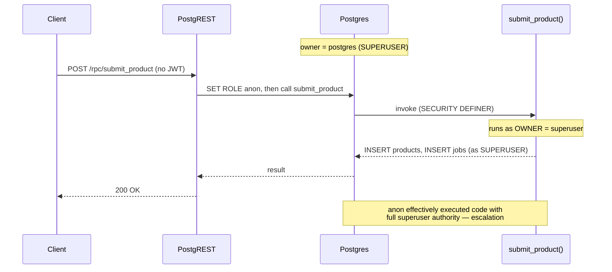
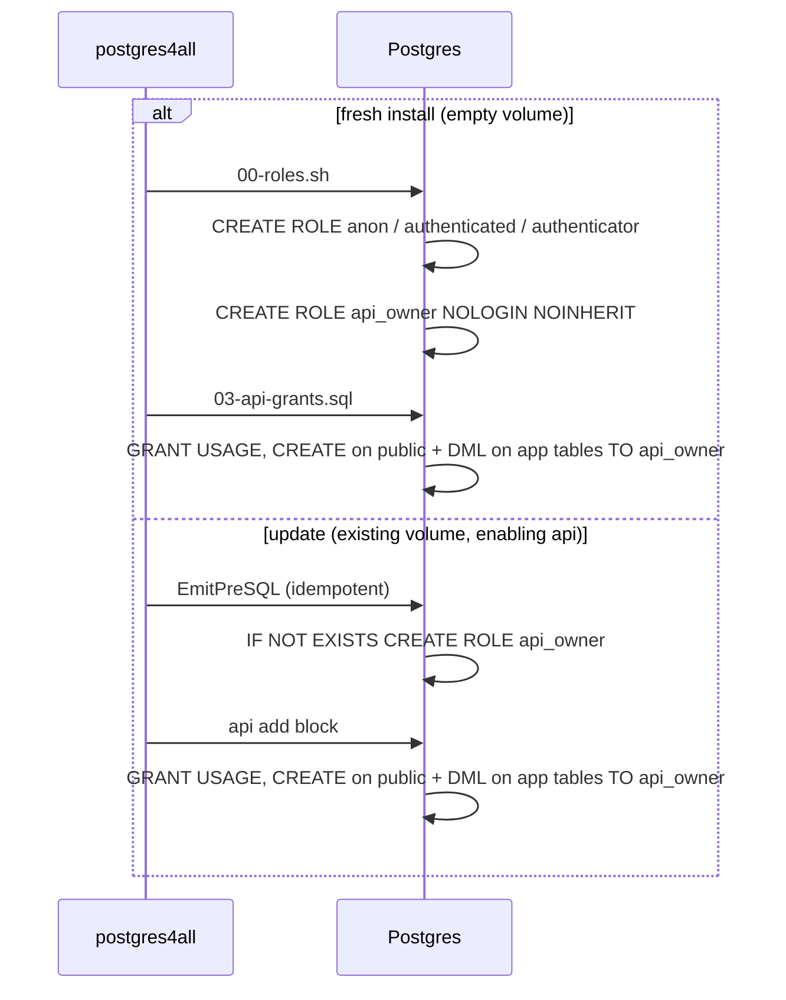
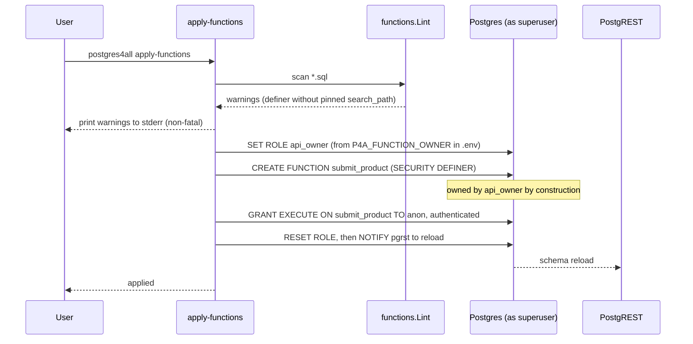
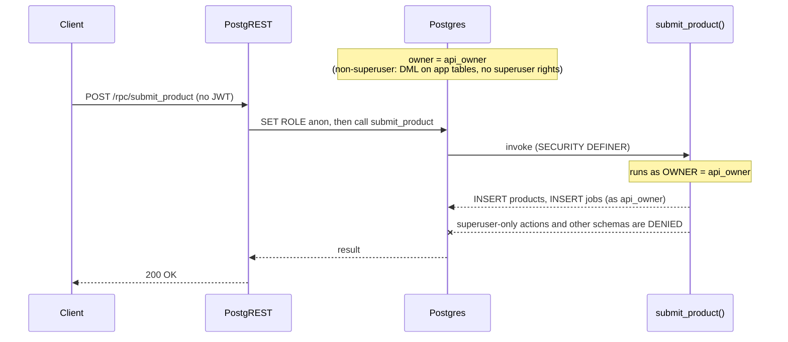

# Scoped SECURITY DEFINER owner + apply-functions lint

**Issue:** postgres4all-cip (prod[critical]: authz hardening) — this scope covers only the
SECURITY DEFINER owner role and the `apply-functions` lint. Per-capability RLS and read/writer
role separation remain deferred sub-parts of the same issue.

**Date:** 2026-06-04

> **Revision (2026-06-05):** After consulting the PostgREST documentation
> ([Database Authorization](https://docs.postgrest.org/en/stable/explanations/db_authz.html)),
> the implementation was changed from the originally-chosen **Approach B** (create as superuser,
> then reassign ownership per-function via `ALTER FUNCTION … OWNER TO api_owner`, with a
> load-bearing lint) to the idiomatic PostgreSQL **create-as-owner** pattern: `apply-functions`
> wraps applied SQL in `SET ROLE api_owner; … RESET ROLE;`, so every function is owned by the
> non-superuser `api_owner` *by construction*. This removes the per-function ownership boilerplate
> from the `.sql` files and demotes the lint to advisory (`search_path` only — the one hazard a tool
> cannot fix for the author). The sections below are updated to describe the adopted approach; the
> original Approach-B rationale is retained under "Approach" for history. Ownership is no longer a
> per-file concern — it is the provisioning model's job, which is the well-documented PG behavior we
> should not be reinventing.

## Problem

`apply-functions` connects to the database as the **superuser** (`POSTGRES_USER`) and runs
`CREATE FUNCTION`. A `SECURITY DEFINER` function runs with the privileges of its *owner* — so a
definer function created this way runs as the **superuser**. The canonical demo
`functions/example_submit.sql` is `SECURITY DEFINER` and is granted `EXECUTE` to `anon`, meaning an
unauthenticated caller invokes a superuser-owned function. A pinned `search_path` mitigates search
path injection but does not change the owner: the function still executes with superuser authority,
which is privilege escalation rather than the intended "one controlled write."

A `SECURITY DEFINER` function is the SQL equivalent of a setuid binary — its security value depends
entirely on *who owns it*. The fix is to give definer functions a powerless owner that holds only
the privileges each function genuinely needs.

### Current call flow (the hole)

## Approach (decision: B, warn-only)

Considered three options:

- **A — automatic `SET ROLE` wrapper:** `apply-functions` wraps applied SQL in
  `SET ROLE api_owner; … RESET ROLE;`. Rejected: hides the mechanism in a tool whose pedagogy is
  "read the SQL," and breaks files containing `GRANT … TO api_owner` (those need superuser).
- **B — explicit `ALTER FUNCTION … OWNER TO api_owner` per file + a lint (CHOSEN):** explicit,
  educational, keeps `apply-functions` running as superuser so in-file GRANTs work, and touches the
  grant generator by only one line.
- **C — lint-only, no role:** rejected — does not close the hole or give authors a role to reassign
  to, which the issue explicitly requires.

The lint is **warn-only**: it prints to stderr and still applies, matching the `audit` command's
"report gaps, don't block" philosophy. A `--strict` flag can follow later if wanted.

## Design

### 1. The `api_owner` role

A login-less, non-superuser role that owns the RPC functions, created only when the `api`
capability is enabled (alongside `anon`/`authenticated`).

- **Definition:** `CREATE ROLE api_owner NOLOGIN NOINHERIT;`.
- **Grants:** `GRANT USAGE, CREATE ON SCHEMA public TO api_owner` (USAGE to resolve objects, CREATE
  so it can own functions created under `SET ROLE`), plus `GRANT SELECT, INSERT, UPDATE, DELETE` on
  the enabled-capability app tables so its `SECURITY DEFINER` functions can do their privileged work.
  This is the conventional PostgREST "schema owner" breadth — bounded to the app's public tables, and
  **never directly reachable by an API caller** because `authenticator` cannot `SET ROLE` to
  `api_owner` (it is granted only `anon`/`authenticated`).
- **Fresh install:** role added to `rolesShScript` (`build/init/00-roles.sh`); grants in
  `writeAPIGrants` (`build/init/03-api-grants.sql`).
- **Update (running install):** role added idempotently to `EmitPreSQL`; grants mirrored in the `api`
  add block and per-cap loop of `EmitAddSQL`; teardown on `api` removal folds `api_owner` into the
  existing `DROP OWNED BY …` line (dropping any functions it owns) followed by
  `DROP ROLE IF EXISTS api_owner;`.
- Callers never `SET ROLE` to `api_owner`. Functions run *as* it via `SECURITY DEFINER`; ownership is
  established at creation time because `apply-functions` runs the file under `SET ROLE api_owner`.

#### Role creation across install vs update

### 2. The lint — `functions.Lint(dir) ([]string, error)`

A best-effort, per-file string scan (no SQL parsing), now checking only the one hazard the tool
cannot fix for the author. For each `*.sql` in the directory:

- Contains `SECURITY DEFINER` (case-insensitive) **and no** `SET search_path` → warn: unpinned
  search_path on a definer function (injection vector).

Ownership is **not** linted: `apply-functions` creates functions under `SET ROLE api_owner`, so a
definer can never silently end up superuser-owned. Returns a slice of `"<file>: <message>"` strings.
`apply-functions` calls `Lint` before applying, prints any warnings to stderr, and proceeds
regardless (warn-only). SQL line comments are stripped before scanning.

#### apply-functions flow with lint + ownership

### 3. The demo — `functions/example_submit.sql`

Because `apply-functions` runs the file under `SET ROLE api_owner`, the function is owned by
`api_owner` automatically — the `.sql` file carries **no ownership machinery at all**. It is plain
`CREATE OR REPLACE FUNCTION …` followed by the existing guarded `GRANT EXECUTE … TO anon,
authenticated`. The leading comment explains that the function runs as the scoped `api_owner`
(which holds DML on the app tables but no superuser rights), not the superuser. The `examples/`
definer functions (`claim_job` PL/pgSQL + PL/Python) are likewise plain `CREATE` — their previously
appended `ALTER … OWNER`/grant `DO`-blocks are removed. `api_owner`'s table privileges come from the
generated grants (`03-api-grants.sql` / the update delta), not from each function file.

### Resulting (hardened) call flow

## Migration

Fresh installs need no migration. For an install provisioned *before* this feature, there are two
considerations, because the `SET ROLE` model creates as `api_owner` rather than reassigning:

1. **The role/grants must exist.** `api_owner` and its `CREATE`/DML grants are emitted on a fresh
   install or when `api` is toggled via `update`. On a pre-feature install, run an `update` (even a
   no-op capability change) so the role and grants are created before re-applying functions.
2. **A pre-existing superuser-owned function blocks re-apply.** `apply-functions` now runs
   `SET ROLE api_owner; CREATE OR REPLACE FUNCTION …`, and a role cannot `CREATE OR REPLACE` a
   function it does not own — so re-applying over a function that is still superuser-owned **errors**
   (`must be owner of function`) rather than silently leaving it. The operator drops the old function
   as the superuser (`DROP FUNCTION …`) and re-applies; it is then created owned by `api_owner`. This
   is a louder, safer failure mode than a silent skip.

## Testing

- `functions.Lint` table test with `testdata` fixtures: only the unpinned-search_path cases warn;
  a definer without `OWNER TO` no longer warns (ownership is structural via `SET ROLE`).
- `functions.EmitSQL` is called with the owner argument; the `SET ROLE`/`RESET ROLE` wrapping is
  exercised via the `apply-functions --dry-run` path.
- Regenerated goldens for `00-roles.sh`, `03-api-grants.sql`, and the update
  `EmitPreSQL` / api-add / api-remove fixtures — **every diff line reviewed**, not blindly accepted.
- A test asserting `api_owner` appears in the generated roles iff `api` is enabled.
- `go test ./...` green.

**Golden-test note:** this deliberately diverges the update goldens from the retired-bash oracle.
That is justified: we are adding behavior the bash implementation never had. Each regenerated line
is reviewed by hand.

## Out of scope (deferred within postgres4all-cip)

- Per-capability RLS option.
- Read/writer role separation for `anon`/`authenticated`.
- A `--strict` mode for the lint (turn warnings into a nonzero exit).
