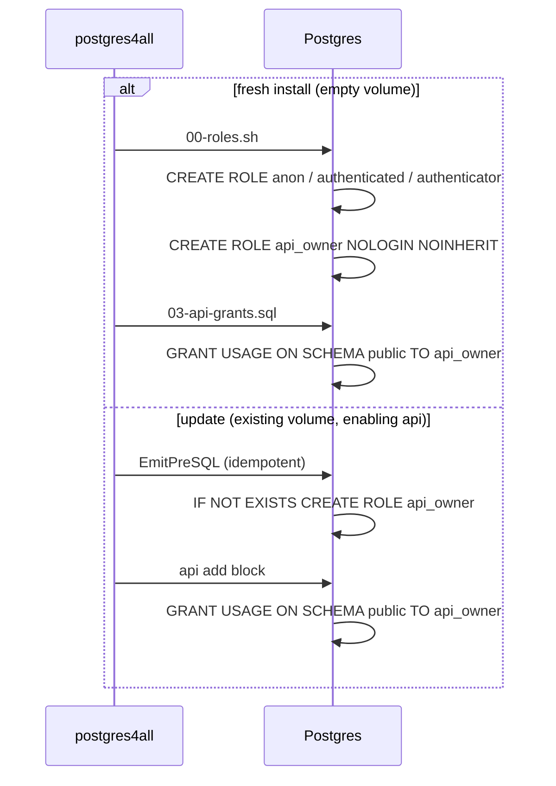

# Scoped SECURITY DEFINER owner + apply-functions lint

**Issue:** postgres4all-cip (prod[critical]: authz hardening) — this scope covers only the
SECURITY DEFINER owner role and the `apply-functions` lint. Per-capability RLS and read/writer
role separation remain deferred sub-parts of the same issue.

**Date:** 2026-06-04

## Problem

`apply-functions` connects to the database as the **superuser** (`POSTGRES_USER`) and runs
`CREATE FUNCTION`. A `SECURITY DEFINER` function runs with the privileges of its *owner* — so a
definer function created this way runs as the **superuser**. The canonical demo
`functions/example_submit.sql` is `SECURITY DEFINER` and is granted `EXECUTE` to `anon`, meaning an
unauthenticated caller invokes a superuser-owned function. A pinned `search_path` mitigates search
path injection but does not change the owner: the function still executes with superuser authority,
which is privilege escalation rather than the intended "one controlled write."

A `SECURITY DEFINER` function is the SQL equivalent of a setuid binary — its security value depends
entirely on *who owns it*. The fix is to give definer functions a powerless owner that holds only
the privileges each function genuinely needs.

### Current call flow (the hole)

```mermaid
sequenceDiagram
    participant Client
    participant PostgREST
    participant DB as Postgres
    participant Fn as submit_product()

    Note over DB: owner = postgres (SUPERUSER)
    Client->>PostgREST: POST /rpc/submit_product (no JWT)
    PostgREST->>DB: SET ROLE anon; SELECT submit_product(...)
    DB->>Fn: invoke (SECURITY DEFINER)
    Note over Fn: runs as OWNER = superuser
    Fn-->>DB: INSERT products, INSERT jobs (as SUPERUSER)
    DB-->>PostgREST: result
    PostgREST-->>Client: 200 OK
    Note over Fn,DB: anon effectively executed code with<br/>full superuser authority — escalation
```

## Approach (decision: B, warn-only)

Considered three options:

- **A — automatic `SET ROLE` wrapper:** `apply-functions` wraps applied SQL in
  `SET ROLE api_owner; … RESET ROLE;`. Rejected: hides the mechanism in a tool whose pedagogy is
  "read the SQL," and breaks files containing `GRANT … TO api_owner` (those need superuser).
- **B — explicit `ALTER FUNCTION … OWNER TO api_owner` per file + a lint (CHOSEN):** explicit,
  educational, keeps `apply-functions` running as superuser so in-file GRANTs work, and touches the
  grant generator by only one line.
- **C — lint-only, no role:** rejected — does not close the hole or give authors a role to reassign
  to, which the issue explicitly requires.

The lint is **warn-only**: it prints to stderr and still applies, matching the `audit` command's
"report gaps, don't block" philosophy. A `--strict` flag can follow later if wanted.

## Design

### 1. The `api_owner` role

A powerless, login-less role, created only when the `api` capability is enabled (alongside
`anon`/`authenticated`).

- **Definition:** `CREATE ROLE api_owner NOLOGIN NOINHERIT;` — no table privileges by default.
- **Ambient grant:** `GRANT USAGE ON SCHEMA public TO api_owner;` so its functions can resolve
  objects in `public`. This is the *only* standing privilege; everything else a function needs is
  granted explicitly by that function's own `.sql` file.
- **Fresh install:** added to `rolesShScript` (`build/init/00-roles.sh`) and the USAGE grant to
  `writeAPIGrants` (`build/init/03-api-grants.sql`).
- **Update (running install):** added idempotently to `EmitPreSQL`
  (`DO $$ … IF NOT EXISTS … CREATE ROLE api_owner … $$;`) and to the `api` add block; teardown on
  `api` removal folds `api_owner` into the existing `DROP OWNED BY …` line (which also drops any
  functions it owns) followed by `DROP ROLE IF EXISTS api_owner;`.
- Callers never `SET ROLE` to `api_owner`. Functions run *as* it via `SECURITY DEFINER`; the
  superuser-connected `apply-functions` performs the `ALTER … OWNER`.

#### Role creation across install vs update



### 2. The lint — `functions.Lint(dir) ([]string, error)`

A best-effort, per-file string scan (no SQL parsing). For each `*.sql` in the directory:

- Contains `SECURITY DEFINER` (case-insensitive) **and no** `SET search_path` → warn: unpinned
  search_path on a definer function (injection vector).
- Contains `SECURITY DEFINER` **and no** `OWNER TO` → warn: "will be owned by the superuser;
  reassign with `ALTER FUNCTION … OWNER TO api_owner`".

Returns a slice of `"<file>: <message>"` strings. `apply-functions` calls `Lint` before applying,
prints any warnings to stderr, and proceeds regardless. Best-effort means it will not catch a
definer in file A whose `OWNER TO` lives in file B — acceptable for a warn-only nudge.

#### apply-functions flow with lint + ownership

```mermaid
sequenceDiagram
    participant User
    participant CLI as apply-functions
    participant Lint as functions.Lint
    participant DB as Postgres (as superuser)
    participant PostgREST

    User->>CLI: postgres4all apply-functions
    CLI->>Lint: scan *.sql
    Lint-->>CLI: warnings (definer unpinned / unowned)
    CLI-->>User: print warnings to stderr (non-fatal)
    CLI->>DB: BEGIN; CREATE FUNCTION submit_product (SECURITY DEFINER)
    Note over DB: created owner = superuser (transiently)
    CLI->>DB: IF EXISTS api_owner THEN ALTER FUNCTION ... OWNER TO api_owner
    CLI->>DB: GRANT INSERT ON products, jobs TO api_owner
    CLI->>DB: NOTIFY pgrst, 'reload schema'; COMMIT
    DB-->>PostgREST: schema reload
    CLI-->>User: applied
```

### 3. The demo — `functions/example_submit.sql`

After the function body, guarded so it applies cleanly on any install — the owner reassignment
runs only when `api_owner` exists, and the table grant only when the target tables exist (i.e.
`document_store` + `job_queue` are enabled). This preserves the file's existing "applies cleanly
even on a non-`api` install" guarantee:

```sql
DO $$ BEGIN
    IF EXISTS (SELECT FROM pg_roles WHERE rolname = 'api_owner') THEN
        ALTER FUNCTION submit_product(text, jsonb) OWNER TO api_owner;
        IF to_regclass('public.products') IS NOT NULL
           AND to_regclass('public.jobs') IS NOT NULL THEN
            GRANT INSERT ON products, jobs TO api_owner;
        END IF;
    END IF;
END $$;
```

The leading comment is rewritten to explain that the function now runs as the scoped `api_owner`
(holding only `INSERT` on `products`/`jobs`), not the superuser — so the "one controlled write"
claim becomes literally true. During implementation, `examples/` is scanned for other definer
functions; any that trip the lint get the same `OWNER TO api_owner` + minimal grant treatment.

### Resulting (hardened) call flow

```mermaid
sequenceDiagram
    participant Client
    participant PostgREST
    participant DB as Postgres
    participant Fn as submit_product()

    Note over DB: owner = api_owner<br/>(USAGE on public + INSERT on products, jobs ONLY)
    Client->>PostgREST: POST /rpc/submit_product (no JWT)
    PostgREST->>DB: SET ROLE anon; SELECT submit_product(...)
    DB->>Fn: invoke (SECURITY DEFINER)
    Note over Fn: runs as OWNER = api_owner
    Fn-->>DB: INSERT products, INSERT jobs (scoped)
    Fn--xDB: anything beyond those grants is DENIED
    DB-->>PostgREST: result
    PostgREST-->>Client: 200 OK
```

## Migration

Existing installs self-heal. A function previously created superuser-owned is re-owned the next
time `apply-functions` runs, because `ALTER … OWNER` re-executes idempotently and the superuser can
re-own any function. No manual migration step. Noted in the commit message.

## Testing

- `functions.Lint` table test with good/bad `testdata` fixtures (definer pinned+owned, definer
  unpinned, definer unowned, non-definer).
- Regenerated goldens for `00-roles.sh`, `03-api-grants.sql`, and the update
  `EmitPreSQL` / api-add / api-remove fixtures — **every diff line reviewed**, not blindly accepted.
- A test asserting `api_owner` appears in the generated roles iff `api` is enabled.
- `go test ./...` green.

**Golden-test note:** this deliberately diverges the update goldens from the retired-bash oracle.
That is justified: we are adding behavior the bash implementation never had. Each regenerated line
is reviewed by hand.

## Out of scope (deferred within postgres4all-cip)

- Per-capability RLS option.
- Read/writer role separation for `anon`/`authenticated`.
- A `--strict` mode for the lint (turn warnings into a nonzero exit).
